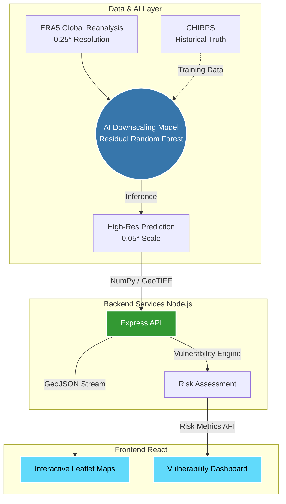

<div align="center">
  
  <h1 align="center">AI Extreme Weather Intelligence Platform</h1>
  
  <p align="center">
    <strong>A next-generation meteorological intelligence dashboard powered by AI downscaling.</strong>
    <br />
    <br />
    <a href="#-architecture">Architecture</a>
    ·
    <a href="#-features">Features</a>
    ·
    <a href="#-tech-stack">Tech Stack</a>
    ·
    <a href="#-getting-started">Getting Started</a>
  </p>
</div>

---

## 🌍 Overview

The **AI Extreme Weather Intelligence Platform** predicts high-impact extreme weather events by taking coarse, low-resolution climate data (like ERA5) and passing it through a custom **Residual Random Forest** pipeline. This generates high-resolution, localized rainfall maps at a 0.05° scale, providing real-time impact assessments for populations, infrastructure, and agriculture.

---

## 🏗️ Architecture

The system operates across three core domains: Data Ingestion/AI, the Backend Server, and the Frontend Dashboard. 



---

## 🚀 Key Features

| Feature | Description | Impact |
|---------|-------------|--------|
| 🌦️ **AI Downscaling** | Converts 25km resolution climate data to 5km hyper-local grids using Machine Learning. | Unlocks localized precision for micro-climates. |
| 📊 **Risk Intelligence** | Automatically calculates vulnerability metrics across Population, Transport, and Agriculture. | Enables data-driven emergency response. |
| 🗺️ **3D Spatial Maps** | Interactive, glassmorphism-themed UI with Leaflet integration to compare Truth vs AI grids. | Beautiful, premium user experience. |
| 📈 **Trend Analysis** | 7-day visual forecasting with automated progress bars and area charts. | Instant recognition of escalating weather risks. |

---

## 💻 Tech Stack

### Frontend
- **Framework**: React + Vite
- **Styling**: Tailwind CSS (with Glassmorphism & 3D CSS effects)
- **Data Visualization**: Recharts, React-Leaflet
- **Icons**: Lucide React

### Backend
- **Runtime**: Node.js
- **Framework**: Express.js
- **Integration**: `child_process` bridging Python scripts for on-the-fly matrix evaluation.

### AI & Machine Learning
- **Languages/Libraries**: Python, NumPy, Scikit-learn, Xarray
- **Model Architecture**: Residual Random Forest (designed for extreme value correction)

---

## 📂 Repository Structure

```text
📦 weather
 ┣ 📂 weather-dashboard/    # 🎨 React/Tailwind Frontend Dashboard
 ┣ 📂 weather-backend/      # ⚙️ Node.js/Express API & Data Ingestion
 ┣ 📂 final_model/          # 🧠 Core Machine Learning Models & Training History
 ┣ 📂 ai/                   # 🔬 AI Data Exploration & Processing Scripts
 ┣ 📂 docs/                 # 📚 Documentation and Extraneous Materials
 ┗ 📜 README.md             # 📖 You are here
```

---

## 🏁 Getting Started

### 1. Start the Backend Server

Open a terminal and navigate to the backend directory:

```bash
cd weather-backend
npm install
npm start
```
*The backend API will run on `http://localhost:3000`*

### 2. Start the Frontend Dashboard

Open a separate terminal and navigate to the dashboard directory:

```bash
cd weather-dashboard
npm install
npm run dev
```
*The frontend will run locally on `http://localhost:5173`*

---

<div align="center">
  <i>Developed to revolutionize meteorological intelligence.</i>
</div>
